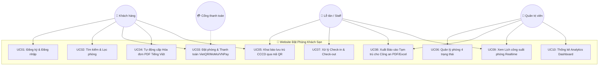

# 📘 Tài Liệu Đặc Tả Use Cases - Hệ Thống Đặt Phòng Khách Sạn

## 📌 1. Danh Sách Actors (Tác Nhân)
1. **Khách hàng (Customer)**: Người dùng vãng lai hoặc đã đăng ký tài khoản, tìm kiếm phòng, thực hiện đặt phòng, thanh toán, khai báo thông tin lưu trú CCCD, xem lịch sử & tải hóa đơn PDF.
2. **Lễ tân / Nhân viên (Receptionist / Staff)**: Quản lý trực tiếp tại quầy, xử lý Check-in / Check-out, quét mã QR CCCD cho đoàn khách, xuất báo cáo lưu trú Công an.
3. **Quản trị viên (Admin)**: Quản lý toàn bộ phòng 4 trạng thái, cấu hình giá, phân quyền tài khoản, xem Lịch công suất phòng realtime & theo dõi Analytics Dashboard.
4. **Cổng thanh toán (Payment Gateway)**: Hệ thống ngân hàng VietQR, ví MoMo, cổng VNPay phản hồi trạng thái giao dịch trực tuyến.

---

## 🧜‍♂️ 2. Sơ Đồ Use Case Diagram Tổng Quan (Mermaid)

---

## 📋 3. Bảng Đặc Tả Chi Tiết 10 Use Cases Cốt Lõi

### 🔹 UC01: Đăng Ký & Đăng Nhập Tài Khoản
* **Mã Use Case**: `UC01`
* **Actor chính**: Khách hàng, Lễ tân, Admin
* **Tiền điều kiện**: Người dùng truy cập website.
* **Luồng chính**:
  1. Người dùng chọn "Đăng nhập" hoặc "Đăng ký".
  2. Hệ thống hiển thị modal nhập liệu với nút **Bật/Tắt Hiển thị Mật khẩu (👁️ Show/Hide)**.
  3. Người dùng nhập email/mật khẩu và bấm nút gửi.
  4. Hệ thống kiểm tra CSDL, khởi tạo Session và hiển thị thông báo thành công.
* **Luồng phụ / Lỗi**: Nếu mật khẩu sai hoặc tài khoản bị khóa -> Thông báo lỗi Tiếng Việt tương ứng.

### 🔹 UC02: Tìm Kiếm & Bộ Lọc Phòng Nâng Cấp
* **Mã Use Case**: `UC02`
* **Actor chính**: Khách hàng
* **Tiền điều kiện**: Hệ thống có danh sách phòng khả dụng.
* **Luồng chính**:
  1. Khách hàng chọn Ngày Check-in, Ngày Check-out, số Người lớn và Trẻ em.
  2. Tích chọn các bộ lọc tiện ích (Wifi, Điều hòa, TV, Hồ bơi...).
  3. Hệ thống lọc danh sách phòng theo điều kiện và hiển thị giá tiền/đêm.
* **Luồng lỗi**: Nếu Check-out <= Check-in -> Hệ thống cảnh báo "Ngày trả phòng phải lớn hơn ngày nhận phòng".

### 🔹 UC03: Đặt Phòng & Thanh Toán Đa Phương Thức
* **Mã Use Case**: `UC03`
* **Actor chính**: Khách hàng, Cổng thanh toán (VietQR/MoMo/VNPay)
* **Tiền điều kiện**: Khách hàng đã đăng nhập và chọn phòng thích hợp.
* **Luồng chính**:
  1. Khách hàng xem tổng tiền và thời gian thực hiện đặt phòng.
  2. Chọn phương thức thanh toán: VietQR (Quét QR ngân hàng), MoMo, VNPay hoặc Tiền mặt tại quầy.
  3. Sau khi xác nhận giao dịch thành công -> Hệ thống lưu đơn hàng `ORD_...` vào CSDL.

### 🔹 UC04: Tự Động Cấp Hóa Đơn Điện Tử PDF Tiếng Việt
* **Mã Use Case**: `UC04`
* **Actor chính**: Khách hàng, Hệ thống
* **Tiền điều kiện**: Đơn đặt phòng thanh toán thành công.
* **Luồng chính**:
  1. Hệ thống tự động kích hoạt thư viện TCPDF sinh file `HD_ORD_...pdf`.
  2. Khách hàng bấm nút "Tải Hóa đơn PDF" trong trang lịch sử đặt phòng.
  3. File PDF tải về hiển thị chuẩn font Tiếng Việt đầy đủ dấu.

### 🔹 UC05: Module Lưu Trú & Quét Mã QR CCCD Tự Động
* **Mã Use Case**: `UC05`
* **Actor chính**: Khách hàng, Lễ tân
* **Tiền điều kiện**: Đã có đơn đặt phòng nhận khách.
* **Luồng chính**:
  1. Người dùng chọn 1 trong 3 phương thức quét QR CCCD:
     - 📁 **Phương thức 1**: Upload file ảnh thẻ CCCD.
     - 📷 **Phương thức 2**: Quét live qua Webcam/Camera.
     - ⌨️ **Phương thức 3**: Dán chuỗi từ máy quét Barcode.
  2. Hệ thống bóc tách dữ liệu QR chuẩn Bộ Công an và tự động điền các ô (Số CCCD, Họ tên, Ngày sinh, Giới tính, Thường trú).
  3. Bấm "Lưu thông tin lưu trú" -> CSDL ghi nhận danh sách đoàn `booking_guests`.

### 🔹 UC06: Admin - Quản Lý Phòng 4 Trạng Thái
* **Mã Use Case**: `UC06`
* **Actor chính**: Quản trị viên, Lễ tân
* **Tiền điều kiện**: Truy cập trang `admin/rooms.php`.
* **Luồng chính**:
  1. Hệ thống hiển thị 6 Thẻ Metric Counters ở đầu trang.
  2. Người dùng thao tác 1-Click tại Dropdown menu của từng dòng phòng để đổi trạng thái nhanh:
     - 🟢 `1. Phòng đang trống`
     - 🟡 `2. Đang dọn dẹp`
     - 🔴 `3. Phòng đang sử dụng`
     - 🔵 `4. Phòng đã được đặt`
     - ⚪ `0. Tạm dừng / Bảo trì`
  3. Hệ thống gửi AJAX cập nhật DB và làm mới Badge màu sắc ngay tức thì.

### 🔹 UC07: Admin - Xử Lý Check-in & Check-out Đơn Phòng
* **Mã Use Case**: `UC07`
* **Actor chính**: Lễ tân
* **Tiền điều kiện**: Có đơn đặt phòng đến ngày nhận/trả.
* **Luồng chính**:
  1. Khi khách đến -> Lễ tân bấm "Check-in" -> Đơn hàng cập nhật & phòng tự động chuyển sang `3. Đang sử dụng`.
  2. Khi khách đi -> Lễ tân bấm "Check-out" -> Đơn hàng hoàn tất & phòng tự động chuyển sang `2. Đang dọn dẹp`.

### 🔹 UC08: Xuất Mẫu Báo Cáo Tạm Trú Cho Công An (PDF/Excel)
* **Mã Use Case**: `UC08`
* **Actor chính**: Lễ tân, Quản trị viên
* **Tiền điều kiện**: Có thông tin khách lưu trú trong ngày.
* **Luồng chính**:
  1. Người dùng vào màn hình Quản lý lưu trú đoàn.
  2. Bấm "Xuất Báo cáo Công an PDF" hoặc "Xuất Báo cáo Công an Excel".
  3. Hệ thống tạo file tương ứng chứa danh sách khai báo tạm trú chuẩn quy định.

### 🔹 UC09: Admin - Lịch Công Suất Phòng Realtime
* **Mã Use Case**: `UC09`
* **Actor chính**: Lễ tân, Quản trị viên
* **Tiền điều kiện**: Truy cập `admin/booking_calendar.php`.
* **Luồng chính**:
  1. Hệ thống hiển thị sơ đồ lịch tháng với màu sắc phân biệt ngày trống và ngày có đơn đặt.
  2. Click vào ô ngày -> Hiển thị popup danh sách các đơn `ORD_...`.
  3. Click vào khách hàng -> Mở Modal `view_booking_modal` xem chi tiết hồ sơ.

### 🔹 UC10: Admin - Analytics Dashboard & Biểu Đồ Doanh Thu
* **Mã Use Case**: `UC10`
* **Actor chính**: Quản trị viên
* **Tiền điều kiện**: Truy cập `admin/dashboard.php`.
* **Luồng chính**:
  1. Hệ thống tính toán các chỉ số kinh doanh: Doanh thu (VNĐ), Đơn hàng, Tỷ lệ lấp đầy phòng (Occupancy Rate %).
  2. Hiển thị Biểu đồ Dual-Axis (Doanh thu & Số lượng đơn) và Biểu đồ Doughnut (Tỷ lệ 4 trạng thái phòng).
  3. Người dùng chọn bộ lọc thời gian (Hôm nay / 7 ngày / Tháng này / Năm nay) -> Biểu đồ tự động cập nhật.
